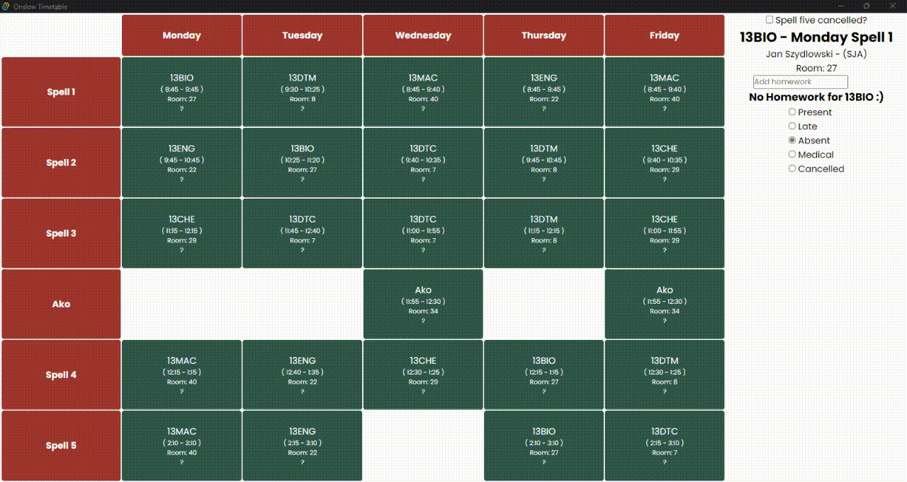
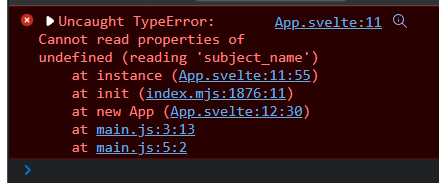
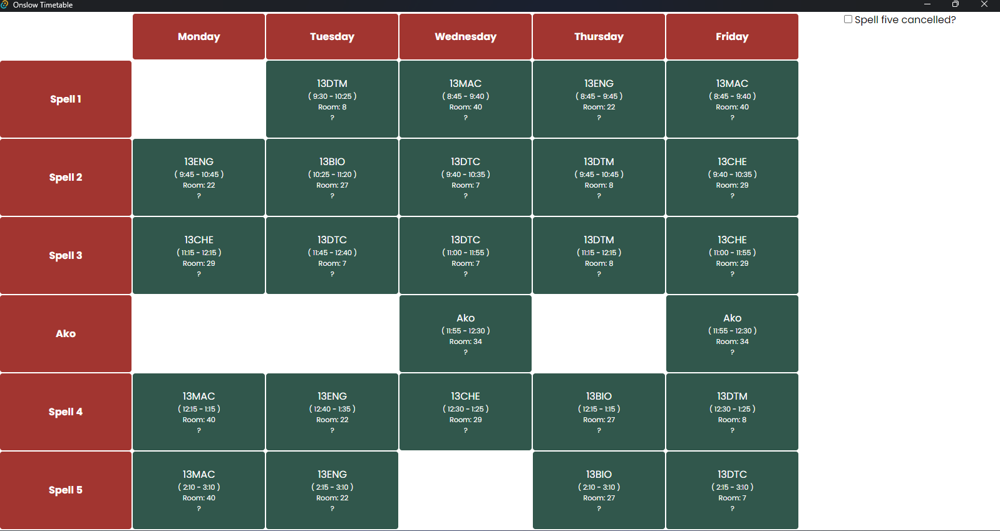
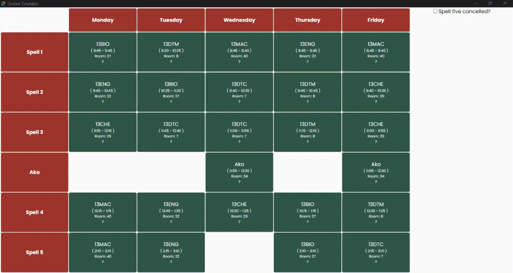

# Testing Table
|E/B/I|Function|Values to enter/Action to take|Expected output| Actual Result| Comments|
|:---:|:---:|:---:|:---:|:---:|:---:|
|E| Selecting a subject|Clicking on the relevant cell|Changing the subject name, spell, teacher name/code, homework and attendance to the clicked subject||None, works as expected|
|B| Selecting corner cells|First and last spells of each day|Checking to see if the subjects update properly| |None, works as expected|
|E| Cancelling spell five| Checking and unchecking the checkbox| See that spell 5 cancels correctly| |None, works as expected|
|B/I| Cancelling spell five while selected| Checking and unchecking the checkbox| See that spell 5 cancels correctly while subject selected is in spell 5| |Works, but doesn't deselect spell 5|
|B/I| Cancelling spell five while selected| Checking and unchecking the checkbox| See that spell 5 cancels correctly while subject selected is in spell 5| |Works, now deselects spell 5|
|B| Not having a spell 1 on monday| Running the program removing spell 1 monday from json| Render with no spell information| | Doesn't work nothing displays|
|B| Not having a spell 1 on monday| Running the program removing spell 1 monday from json| Render with no spell information| | Works, now starts with a null subject|
|B| Selecting corner cells|First and last spells of each day|Subject info should update according to the clicked cell| |None, works as expected|
|E| Marking attendance of specific subjects|Change attendance using the info bar| Should record attendance in both the table and info bar| |None, works as expected|
|B/E|Selecting the two edge case for attendance|Select present and cancelled| Should update the GUI correctly| | None, works as expected|
|E|Selecting Attendance for subject to be cancelled| Select the Attendance for a spell 5 subject then cancel and uncancel spell 5|The GUI should be updated correctly and the information should remain after the subject has been cancelled| | None, works as expected|