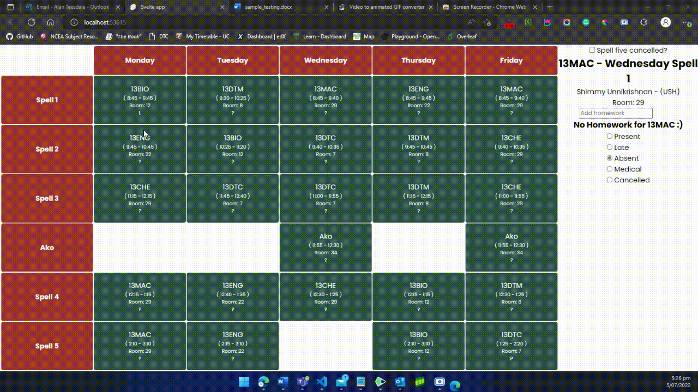
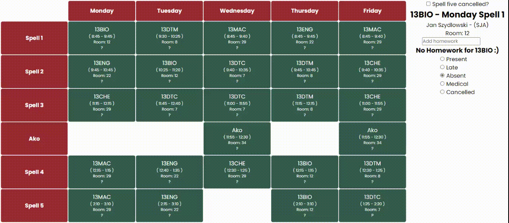

# Testing Table
|E/B/I|Function|Values to enter/Action to take|Expected output| Actual Result| Comments|
|:---:|:---:|:---|:---:|:---:|:---:|
|E| Selecting a subject|Clicking on the relevant cell|Changing the subject name, spell, teacher name/code, homework and attendance to the clicked subject||None, works as expected|
|B| Selecting corner cells|First and last spells of each day|Subject info should update according to the clicked cell| |None, works as expected|
